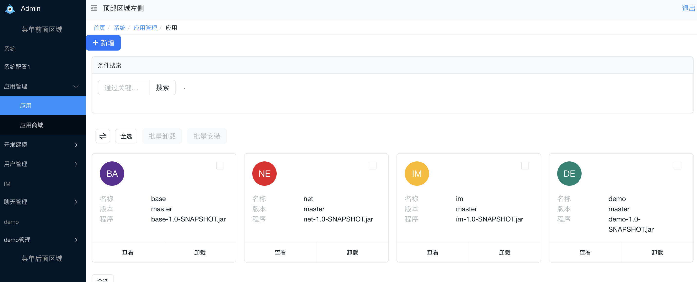
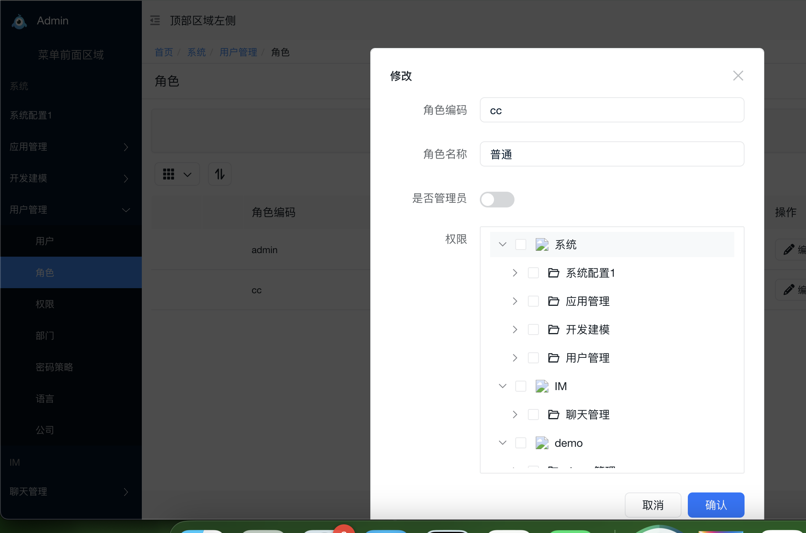
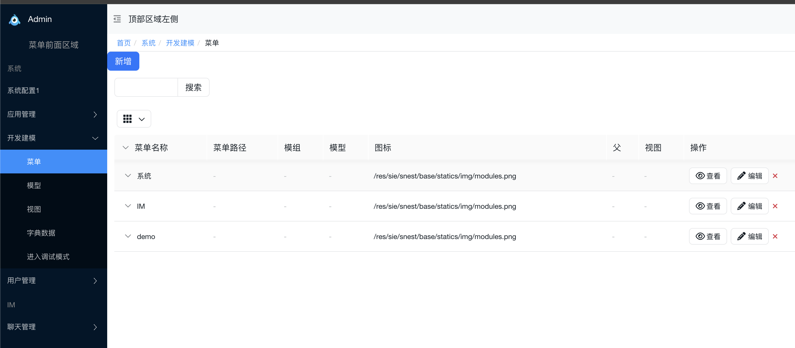

# 基于amis后端低代码平台

* 写这个平台是为了解决多年对于项目的困扰，不想碰到新项目就重新来，通过业务模块的积累，能进行模块化安装。
* 新的项目只需要安装模块就能搭建一套完整的业务系统。
* amis-api 的所有基础代码都以模块的形式组合在一起。这些模块可以随时从数据库中安装或卸载。
* 这些模块有两大目的。要么你可以添加新应用/业务逻辑，要么你可以修改已有应用。
* 简言之，amis-api 中的一切都始于模块也终于模块。amis-api 由不同规模的公司所使用，每个公司都有不同的业务流和要求。处理这一问题，amis-api 将应用的功能拆分到了不同的模块中。这些模块可按需在数据库中进行加载。基本上，用户可以在任何时间点启用/禁用这些功能。因此，相同的软件可以按不同的要求进行调整。

## 功能介绍

1. 模组管理
   安装模组，卸载模组

   
2. 权限管理
   用户管理，角色管理，部门管理
   
3. 开发管理
   菜单管理，模型管理，视图管理
   
4. 系统管理

## 版权声明

ORM参照Jfinal 框架  独创Db + Record模式，灵活便利 ActiveRecord支持，使数据库开发极致快速 [https://gitee.com/jfinal/jfinal.git](https://)

Odoo 是一个模块化系统，所有的业务功能都是由**模块**(module)提供的。

[https://gitee.com/mirrors/odoo.git](https://)

## 版权信息

软件遵循[MIT](https://baike.baidu.com/item/MIT/10772952)开源协议，意味着您无需支付任何费用，也无需授权，即可将 软件应用到您的产品中。
注意：这并不意味着您可以将软件应用到非法的领域，比如涉及赌博、色情、暴力、宗教等方面。
如因此产生纠纷等法律问题， 作者不承担任何责任。切勿以身试法!!! 网络不是法外之地
声明：软件仅供学习交流，严禁用于商业用途。

## 目录介绍

amis-api

| 模块    | 说明        | 进度 |
| ------- | ----------- | ---- |
| base    | 基础模块    | 90%  |
| im      | 聊天软件    | 90%  |
| net     | websocket   | 100% |
| demo    | demo模块    | 90%  |
| lowcode | 引擎源代码  | 90%  |
| service | spring boot | 100% |

## 小白手册

[项目说明](project.md)

[模快说明](app.md)

[实体说明](model.md)

[服务说明](servcie.md)

[属性说明](property.md)

[条件说明](where.md)

[接口说明](api.md)

[视图说明](view.md)
